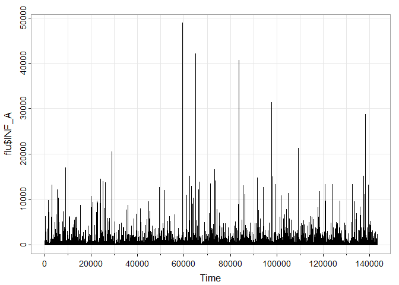

STAT 626 Time Series - Group 1 Project - Forecasting the Flu
================
Group 1 / Alex Hughes

## Libraries and plot theme

``` r
library(tidyverse)
library(astsa)
library(lubridate)
theme_set(theme_bw())
```

## Flu data

``` r
flu <- read_csv("VIW_FNT.csv")
head(flu)
```

    # A tibble: 6 × 49
      WHOREGION FLUSEASON HEMISPHERE ITZ         COUNTRY_CODE COUNTRY_AREA_TERRITORY
      <chr>     <chr>     <chr>      <chr>       <chr>        <chr>                 
    1 EUR       NH        NH         FLU_SW_EUR  PRT          Portugal              
    2 AMR       YR        NH         FLU_CNT_AMC HND          Honduras              
    3 AMR       YR        NH         FLU_CNT_AMC HND          Honduras              
    4 AFR       YR        NH         FLU_WST_AFR MLI          Mali                  
    5 EUR       NH        NH         FLU_NTH_EUR IRL          Ireland               
    6 EMR       YR        NH         FLU_WST_AS… JOR          Jordan                
    # ℹ 43 more variables: ISO_WEEKSTARTDATE <date>, ISO_YEAR <dbl>,
    #   ISO_WEEK <dbl>, MMWR_WEEKSTARTDATE <date>, MMWR_YEAR <dbl>,
    #   MMWR_WEEK <dbl>, ORIGIN_SOURCE <chr>, SPEC_PROCESSED_NB <dbl>,
    #   SPEC_RECEIVED_NB <dbl>, AH1N12009 <dbl>, AH1 <dbl>, AH3 <dbl>, AH5 <dbl>,
    #   AH7N9 <dbl>, ANOTSUBTYPED <dbl>, ANOTSUBTYPABLE <dbl>,
    #   AOTHER_SUBTYPE <dbl>, AOTHER_SUBTYPE_DETAILS <dbl>, INF_A <dbl>,
    #   BVIC_2DEL <dbl>, BVIC_3DEL <dbl>, BVIC_NODEL <dbl>, BVIC_DELUNK <dbl>, …

## Aggregate across countries to create flu count by date time series datasets for Influenza A, B, and all strains

``` r
InfA <- flu %>% 
  group_by(ISO_WEEKSTARTDATE) %>%
  summarise(total_flu = sum(INF_A, na.rm = T))

InfB <- flu %>%
  group_by(ISO_WEEKSTARTDATE) %>%
  summarise(total_flu = sum(INF_B, na.rm = T))

InfA$subtype <- "Inf_A"
InfB$subtype <- "Inf_B"

flu_df <- bind_rows(InfA, InfB)

InfAll <- flu %>% # contains more than just A and B; many strains
  group_by(ISO_WEEKSTARTDATE) %>%
  summarise(total_flu = sum(INF_ALL, na.rm = T))
```

## Plot Influenza A over time

``` r
# ggplot(flu, aes(x = ISO_WEEKSTARTDATE, y = INF_A))+
#   geom_line()

ggplot(InfA, aes(x = ISO_WEEKSTARTDATE, y = total_flu))+
  geom_line()+
  labs(x = "Time (in weeks)", y = "Influenza A number of specimens")
```


``` r
ggsave('InfA-by-year.png')
```

    Saving 7 x 5 in image

## Plot Influenza A vs Influenza B over time

``` r
ggplot(flu_df, aes(x = ISO_WEEKSTARTDATE, y = total_flu, color = subtype))+
  geom_line()+
  labs(x = "Time (in weeks)", y = "Number of specimens")
```


``` r
ggsave('InfA-vs-InfB-time-series.png')
```

    Saving 7 x 5 in image

``` r
tsplot(flu$INF_A)
```



# Merge flu and drought

Drought data was downloaded from
https://droughtmonitor.unl.edu/DmData/DataDownload/DSCI.aspx

Set 1/1/2001 to 12/31/2010

``` r
dr <- read_csv("dm_export_20010101_20101231.csv")
```

    Rows: 523 Columns: 3
    ── Column specification ────────────────────────────────────────────────────────
    Delimiter: ","
    chr (1): Name
    dbl (2): MapDate, DSCI

    ℹ Use `spec()` to retrieve the full column specification for this data.
    ℹ Specify the column types or set `show_col_types = FALSE` to quiet this message.

``` r
drought_clean <- dr %>%
  mutate(MapDate = ymd(MapDate)) %>%
  mutate(MMWR_WEEK = epiweek(MapDate), # create mmwr week and year variables for matching w/ flu dataset
         MMWR_YEAR = epiyear(MapDate))

USAflu <- flu %>%
  filter(COUNTRY_CODE == "USA") %>%
  filter(MMWR_WEEKSTARTDATE > as.Date("2000-12-31") & MMWR_WEEKSTARTDATE <= as.Date("2010-12-31")) %>%
  dplyr::select(MMWR_WEEK, MMWR_YEAR, INF_A, INF_B, INF_ALL)

df <- left_join(USAflu, drought_clean, by = c("MMWR_WEEK", "MMWR_YEAR")) %>%
  arrange(MapDate)

# want complete cases only

df <- df[complete.cases(df[ , c("MMWR_WEEK", "MMWR_YEAR", "INF_A", "INF_B", "INF_ALL", "DSCI")]), ] 

write_csv(df, 'complete-flu-drought-2001-2010.csv')
```

# Merge flu and google flu trends

``` r
trends <- readxl::read_excel("Flue 2004-2014 weekly.xls")

trends_merge_ready <- trends %>%
  mutate(MMWR_WEEK = epiweek(Week), # create mmwr week and year variables for matching
         MMWR_YEAR = epiyear(Week)) %>%
  rename(flu_searches = `flu: (United States)`) 

flu_drought_searches <- left_join(df, trends_merge_ready, by = c("MMWR_WEEK", "MMWR_YEAR")) %>% # this dataset has the 2001 to 2010 date range even though searches data doesn't start until 2004
  dplyr::select(!Week)

write_csv(flu_drought_searches, 'flu-and-drought-and-googletrends.csv')

# also create a version that only spans dates present in all 3 datasets:

flu_drought_searches %>%
  filter(!is.na(flu_searches)) %>%
  write_csv('flu-and-drought-and-googletrends-2004-2010.csv')
```
